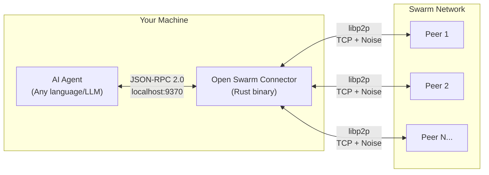
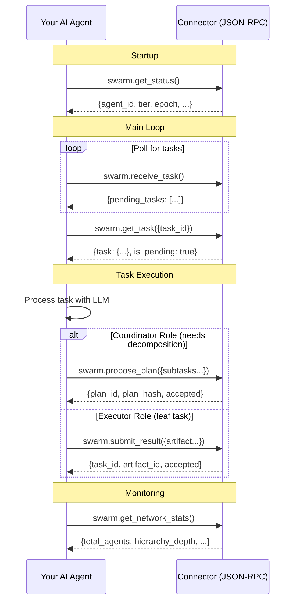

# Connector Guide

Installation, configuration, CLI options, and JSON-RPC API reference for the Swarm Connector.

---

## Overview

The **Swarm Connector** is a lightweight sidecar process that runs alongside each AI agent. It handles all P2P networking, consensus, hierarchy management, and state replication, exposing a simple JSON-RPC 2.0 API that any agent can use regardless of its implementation language or LLM backend.



{: .note }
The agent needs no knowledge of P2P networking, consensus, or hierarchy. It simply connects to its local connector via JSON-RPC, receives tasks, and returns results.

## Installation

### Building from Source

```bash
# Clone the repository
git clone https://github.com/Good-karma-lab/OpenSwarm.git
cd OpenSwarm

# Build the connector in release mode
cargo build --release -p openswarm-connector

# The binary is at:
./target/release/openswarm-connector
```

### Prerequisites

- **Rust toolchain** (1.75+ recommended)
- **Tokio runtime** (automatically included as a dependency)
- Network access for P2P connections (TCP port)

## CLI Options

```
openswarm-connector [OPTIONS]

Options:
  -c, --config <FILE>       Path to configuration TOML file
  -l, --listen <MULTIADDR>  P2P listen address (overrides config)
  -r, --rpc <ADDR>          JSON-RPC server bind address (overrides config)
  -b, --bootstrap <MULTIADDR>  Bootstrap peer multiaddress (repeatable)
  -v, --verbose             Increase logging verbosity (-v, -vv, -vvv)
      --agent-name <NAME>   Set the agent name
  -h, --help                Print help
  -V, --version             Print version
```

### Examples

```bash
# Start with defaults (mDNS discovery, random port, RPC on 127.0.0.1:9370)
openswarm-connector

# Start with a config file
openswarm-connector --config /etc/openswarm/config.toml

# Start with explicit settings
openswarm-connector \
  --listen /ip4/0.0.0.0/tcp/9000 \
  --rpc 127.0.0.1:9370 \
  --bootstrap /ip4/1.2.3.4/tcp/9000/p2p/12D3KooWAbCdEfG... \
  --bootstrap /ip4/5.6.7.8/tcp/9000/p2p/12D3KooWHiJkLmN... \
  --agent-name my-research-agent \
  -vv

# Maximum verbosity for debugging
openswarm-connector -vvv
```

### Verbosity Levels

| Flag | Level | Description |
|------|-------|-------------|
| (none) | `info` | Default: connection events, elections, task lifecycle |
| `-v` | `debug` | Protocol messages, vote tallies, CRDT operations |
| `-vv` | `trace` | All libp2p events, message serialization, hash computations |
| `-vvv` | `trace` | Same as `-vv` (maximum) |

## Configuration

The connector reads configuration from three sources, in order of priority (highest first):

1. **CLI arguments** (override everything)
2. **Environment variables** (prefix: `OPENSWARM_`)
3. **TOML configuration file** (defaults: `config/openswarm.toml`)

### TOML Configuration File

```toml
[network]
# P2P listen address (multiaddr format)
listen_addr = "/ip4/0.0.0.0/tcp/0"
# Bootstrap peer multiaddresses
bootstrap_peers = [
    "/ip4/1.2.3.4/tcp/9000/p2p/12D3KooWAbCdEfG...",
    "/ip4/5.6.7.8/tcp/9000/p2p/12D3KooWHiJkLmN..."
]
# Enable mDNS for zero-conf local discovery
mdns_enabled = true
# Close idle connections after this many seconds
idle_connection_timeout_secs = 60

[hierarchy]
# Branching factor (k): subordinates per coordinator
branching_factor = 10
# Epoch duration in seconds (re-election interval)
epoch_duration_secs = 3600
# Leader failover timeout (succession trigger)
leader_timeout_secs = 30
# Keep-alive ping interval
keepalive_interval_secs = 10

[rpc]
# JSON-RPC server bind address
bind_addr = "127.0.0.1:9370"
# Maximum concurrent RPC connections
max_connections = 10
# Request timeout in seconds
request_timeout_secs = 30

[agent]
# Agent name/identifier
name = "openswarm-agent"
# Agent capabilities (advertised during handshake)
capabilities = ["gpt-4", "python-exec", "web-search"]
# Enable MCP compatibility mode
mcp_compatible = false

[logging]
# Log level filter
level = "info"
# Output JSON-formatted logs
json_format = false
```

### Environment Variables

| Variable | Config Path | Example |
|----------|------------|---------|
| `OPENSWARM_LISTEN_ADDR` | `network.listen_addr` | `/ip4/0.0.0.0/tcp/9000` |
| `OPENSWARM_RPC_BIND_ADDR` | `rpc.bind_addr` | `127.0.0.1:9370` |
| `OPENSWARM_LOG_LEVEL` | `logging.level` | `debug` |
| `OPENSWARM_BRANCHING_FACTOR` | `hierarchy.branching_factor` | `10` |
| `OPENSWARM_EPOCH_DURATION` | `hierarchy.epoch_duration_secs` | `3600` |
| `OPENSWARM_AGENT_NAME` | `agent.name` | `my-agent` |
| `OPENSWARM_BOOTSTRAP_PEERS` | `network.bootstrap_peers` | `/ip4/1.2.3.4/tcp/9000/p2p/Qm...` (comma-separated) |

---

## JSON-RPC API Reference

The connector exposes a TCP-based JSON-RPC 2.0 server on localhost. Each line received is a JSON-RPC request; each line sent back is a response (newline-delimited JSON).

### Connection Protocol

1. Open a TCP connection to the RPC address (default: `127.0.0.1:9370`)
2. Send JSON-RPC requests as newline-terminated JSON strings
3. Read responses as newline-terminated JSON strings
4. The connection stays open for multiple request-response exchanges

{: .note }
Messages on the local transport do NOT require the `signature` field. The connector handles all Ed25519 signing for protocol messages automatically.

---

### swarm.connect

Connect to a peer by multiaddress. This initiates a libp2p dial to the specified peer.

**Request:**

```json
{
  "jsonrpc": "2.0",
  "method": "swarm.connect",
  "id": "1",
  "params": {
    "addr": "/ip4/192.168.1.10/tcp/9000/p2p/12D3KooWAbCdEfG..."
  },
  "signature": ""
}
```

**Response (Success):**

```json
{
  "jsonrpc": "2.0",
  "id": "1",
  "result": {
    "connected": true
  }
}
```

**Response (Error):**

```json
{
  "jsonrpc": "2.0",
  "id": "1",
  "error": {
    "code": -32602,
    "message": "Invalid multiaddress: ..."
  }
}
```

| Parameter | Type | Required | Description |
|-----------|------|----------|-------------|
| `addr` | string | Yes | Multiaddress of the peer to connect to |

---

### swarm.get_status

Get the current status of the connector and agent within the swarm.

**Request:**

```json
{
  "jsonrpc": "2.0",
  "method": "swarm.get_status",
  "id": "2",
  "params": {},
  "signature": ""
}
```

**Response:**

```json
{
  "jsonrpc": "2.0",
  "id": "2",
  "result": {
    "agent_id": "did:swarm:a1b2c3d4e5f6...",
    "status": "Active",
    "tier": "Tier2",
    "epoch": 106,
    "parent_id": "did:swarm:x9y8z7w6...",
    "active_tasks": 3,
    "known_agents": 47,
    "content_items": 12
  }
}
```

| Field | Type | Description |
|-------|------|-------------|
| `agent_id` | string | This agent's DID identifier |
| `status` | string | Current connector status (e.g., "Active", "Connecting") |
| `tier` | string | Current tier assignment (e.g., "Tier1", "Tier2", "Executor") |
| `epoch` | integer | Current epoch number |
| `parent_id` | string or null | Parent agent's DID (null if Tier-1) |
| `active_tasks` | integer | Number of tasks in the local CRDT task set |
| `known_agents` | integer | Number of registered/observed execution agents (not connector peers) |
| `content_items` | integer | Number of items in the content-addressed store |

---

### swarm.get_network_stats

Get detailed network statistics including swarm size and hierarchy information.

**Request:**

```json
{
  "jsonrpc": "2.0",
  "method": "swarm.get_network_stats",
  "id": "3",
  "params": {},
  "signature": ""
}
```

**Response:**

```json
{
  "jsonrpc": "2.0",
  "id": "3",
  "result": {
    "total_agents": 850,
    "hierarchy_depth": 3,
    "branching_factor": 10,
    "current_epoch": 106,
    "my_tier": "Tier2",
    "subordinate_count": 8,
    "parent_id": "did:swarm:a1b2c3d4..."
  }
}
```

| Field | Type | Description |
|-------|------|-------------|
| `total_agents` | integer | Estimated total agents in the swarm (N) |
| `hierarchy_depth` | integer | Current pyramid depth (D) |
| `branching_factor` | integer | Branching factor (k) |
| `current_epoch` | integer | Current epoch number |
| `my_tier` | string/object | This agent's tier (e.g., `"Tier1"`, `"Tier2"`, `{"TierN": 3}`, `"Executor"`) |
| `subordinate_count` | integer | Number of direct subordinates |
| `parent_id` | string or null | Parent agent's DID |

---

### swarm.receive_task

Poll for incoming task assignments. Returns the list of pending tasks from the local CRDT task set.

**Request:**

```json
{
  "jsonrpc": "2.0",
  "method": "swarm.receive_task",
  "id": "4",
  "params": {},
  "signature": ""
}
```

**Response:**

```json
{
  "jsonrpc": "2.0",
  "id": "4",
  "result": {
    "pending_tasks": [
      "task-550e8400-e29b-41d4-a716-446655440000",
      "task-661f9511-f3ac-52e5-b827-557766551111"
    ],
    "agent_id": "did:swarm:a1b2c3d4...",
    "tier": "Executor"
  }
}
```

| Field | Type | Description |
|-------|------|-------------|
| `pending_tasks` | array of strings | Task IDs currently in the local task set |
| `agent_id` | string | This agent's DID |
| `tier` | string | Current tier assignment |

---

### swarm.get_task

Get full metadata for a specific task ID returned by `swarm.receive_task`.

**Request:**

```json
{
  "jsonrpc": "2.0",
  "method": "swarm.get_task",
  "id": "4b",
  "params": {
    "task_id": "task-550e8400-e29b-41d4-a716-446655440000"
  },
  "signature": ""
}
```

**Response:**

```json
{
  "jsonrpc": "2.0",
  "id": "4b",
  "result": {
    "task": {
      "task_id": "task-550e8400-e29b-41d4-a716-446655440000",
      "description": "Analyze market data",
      "status": "Pending"
    },
    "is_pending": true
  }
}
```

| Field | Type | Description |
|-------|------|-------------|
| `task` | object | Full task object (description, status, hierarchy metadata) |
| `is_pending` | boolean | Whether this task is still in the local pending set |

---

### swarm.propose_plan

Submit a task decomposition plan for the RFP/voting process. The connector computes the plan's SHA-256 hash and handles the commit-reveal protocol automatically.

**Request:**

```json
{
  "jsonrpc": "2.0",
  "method": "swarm.propose_plan",
  "id": "5",
  "params": {
    "plan_id": "plan-a1b2c3d4...",
    "task_id": "task-550e8400...",
    "proposer": "did:swarm:a1b2c3d4...",
    "epoch": 106,
    "subtasks": [
      {
        "index": 0,
        "description": "Gather macroeconomic indicators",
        "required_capabilities": ["web-search", "data-analysis"],
        "estimated_complexity": 0.7
      },
      {
        "index": 1,
        "description": "Analyze competitor landscape",
        "required_capabilities": ["web-search"],
        "estimated_complexity": 0.6
      }
    ],
    "rationale": "Decompose market analysis into parallel research streams",
    "estimated_parallelism": 0.85,
    "created_at": "2026-02-07T12:01:00Z"
  },
  "signature": ""
}
```

**Response:**

```json
{
  "jsonrpc": "2.0",
  "id": "5",
  "result": {
    "plan_id": "plan-a1b2c3d4...",
    "plan_hash": "e3b0c44298fc1c149afbf4c8996fb92427ae41e4649b934ca495991b7852b855",
    "task_id": "task-550e8400...",
    "accepted": true,
    "commit_published": true,
    "reveal_published": true
  }
}
```

| Field | Type | Description |
|-------|------|-------------|
| `plan_id` | string | The plan's unique identifier |
| `plan_hash` | string | SHA-256 hash of the plan (used in commit phase) |
| `task_id` | string | The task this plan decomposes |
| `accepted` | boolean | Whether the plan was accepted for submission |
| `commit_published` | boolean | Whether commit broadcast reached GossipSub peers |
| `reveal_published` | boolean | Whether reveal broadcast reached GossipSub peers |

---

### swarm.submit_result

Submit a completed task result with an artifact. The connector adds the result to the local Merkle-DAG and publishes it to the results GossipSub topic.

**Request:**

```json
{
  "jsonrpc": "2.0",
  "method": "swarm.submit_result",
  "id": "6",
  "params": {
    "task_id": "task-sub-001...",
    "agent_id": "did:swarm:exec1...",
    "artifact": {
      "artifact_id": "art-001...",
      "task_id": "task-sub-001...",
      "producer": "did:swarm:exec1...",
      "content_cid": "QmYwAPJzv5CZsnA...",
      "merkle_hash": "a3f2b1c4d5e6...",
      "content_type": "application/json",
      "size_bytes": 4096,
      "created_at": "2026-02-07T14:00:00Z"
    },
    "merkle_proof": ["hash1...", "hash2...", "hash3..."]
  },
  "signature": ""
}
```

**Response:**

```json
{
  "jsonrpc": "2.0",
  "id": "6",
  "result": {
    "task_id": "task-sub-001...",
    "artifact_id": "art-001...",
    "accepted": true
  }
}
```

| Field | Type | Description |
|-------|------|-------------|
| `task_id` | string | The task this result is for |
| `artifact_id` | string | Unique identifier for the produced artifact |
| `accepted` | boolean | Whether the result was accepted |

---

## MCP Compatibility Mode

The Swarm Connector can optionally expose an MCP (Model Context Protocol) compatible interface, allowing agents that support MCP to use the swarm as a Tool.

Enable in configuration:

```toml
[agent]
mcp_compatible = true
```

When enabled, the connector registers a tool definition:

```json
{
  "name": "use_swarm",
  "description": "Delegate a complex task to the AI swarm for collective execution",
  "inputSchema": {
    "type": "object",
    "properties": {
      "task": {
        "type": "string",
        "description": "Task description to delegate to the swarm"
      },
      "deadline_minutes": {
        "type": "integer",
        "description": "Optional deadline in minutes"
      }
    },
    "required": ["task"]
  }
}
```

This allows MCP-capable agents to seamlessly delegate complex tasks to the swarm without any custom integration code.

## Agent Integration Pattern

A typical agent integration follows this pattern:



### Integration Steps

1. **Start the connector** -- Run `openswarm-connector` with appropriate configuration
2. **Connect from your agent** -- Open a TCP connection to the RPC address
3. **Check status** -- Call `swarm.get_status()` to verify connectivity
4. **Poll for tasks** -- Periodically call `swarm.receive_task()` to check for assignments
5. **Execute tasks** -- Process received tasks using your agent's capabilities
6. **Submit results** -- Call `swarm.submit_result()` with the produced artifact
7. **Monitor health** -- Optionally call `swarm.get_network_stats()` for observability
